# Cards Against COVID

I hate COVID-19, keeping us all couped up inside, but you know what I do love, Cards Against Humanity, and Blazor, and Azure Functions. So all of that combined with some free time and free Azure credits has produced this monstrosity.

This game should contain about 7k black prompt cards and about 24k White response cards, so I think that is just about every card ever made.

**NOTE: As per CAH's T&Cs, I am not making anything off this and anyone who wants it can have it**

## Why?
Why the fuck not?

## Technology Stack

- **Frontend**: React 19 + TypeScript with Vite
- **Backend**: Azure Functions v4 (.NET 8.0) with Isolated Worker Model
- **State Management**: Redux Toolkit
- **Infrastructure**: Azure Static Web Apps + Azure Functions + Azure Table Storage
- **Deployment**: GitHub Actions + Bicep IaC
- **Real-time**: Long Polling for state synchronization
- **Observability**: Application Insights with OpenTelemetry support
- **Local Development**: Azure Static Web Apps CLI

## Prerequisites

- [.NET 8.0 SDK](https://dotnet.microsoft.com/download/dotnet/8.0)
- [.NET 6.0 SDK](https://dotnet.microsoft.com/download/dotnet/6.0) (for Azure Functions)
- [Azure CLI](https://docs.microsoft.com/en-us/cli/azure/install-azure-cli) (for deployment)
- [Azure Functions Core Tools](https://docs.microsoft.com/en-us/azure/azure-functions/functions-run-local) (for local development)

## Local Development

### Prerequisites

- [.NET 8.0 SDK](https://dotnet.microsoft.com/download/dotnet/8.0)
- [Node.js 20.x+](https://nodejs.org/)
- [Azure Functions Core Tools v4](https://docs.microsoft.com/en-us/azure/azure-functions/functions-run-local)
- [Azure Static Web Apps CLI](https://azure.github.io/static-web-apps-cli/) (installed as dev dependency)
- Azure Storage Emulator (Azurite) or Azure Storage connection string

### Build the solution

```bash
dotnet restore
dotnet build --configuration Release
```

### Run locally with Azure Static Web Apps CLI

The Azure Static Web Apps CLI provides local development with automatic API routing without CORS issues.

1. **Set up local.settings.json for Azure Functions**:
   ```bash
   cd CardsAgainstHumanity.Api
   cp local.settings.json.example local.settings.json
   # Edit local.settings.json with your storage connection strings
   ```

2. **Option 1 - Use SWA CLI (Recommended)**:
   
   This will start both the React app and Azure Functions together with proper routing:
   ```bash
   cd CardsAgainstHumanity.Web
   npm install
   npm start
   ```
   
   The app will be available at `http://localhost:4280` with API automatically routed through `/api/*`.

3. **Option 2 - Run separately (for debugging)**:
   
   **Terminal 1 - Start the API (Azure Functions)**:
   ```bash
   cd CardsAgainstHumanity.Api
   func start
   ```
   
   **Terminal 2 - Start the React app**:
   ```bash
   cd CardsAgainstHumanity.Web
   npm install
   npm run dev
   ```
   
   The React app will be available at `http://localhost:5173` and will connect to the API at `http://localhost:7071/api`.

## Deployment

### Infrastructure Deployment

The infrastructure is managed using Bicep templates in the `infrastructure/` directory.

1. **Login to Azure**:
   ```bash
   az login
   ```

2. **Create Resource Group**:
   ```bash
   az group create --name rg-cards-against-covid --location eastus
   ```

3. **Deploy Infrastructure**:
   ```bash
   az deployment group create \
     --resource-group rg-cards-against-covid \
     --template-file infrastructure/main.bicep \
     --parameters infrastructure/parameters.json
   ```

### GitHub Actions Deployment

Deployment is automated via GitHub Actions:

- **PR Build** (`.github/workflows/pr-build.yml`): Builds and validates on pull requests
- **Release** (`.github/workflows/release.yml`): Deploys infrastructure and applications to Azure

#### Setup GitHub Secrets

1. Create an Azure Service Principal:
   ```bash
   az ad sp create-for-rbac --name "github-cards-against-covid" --role contributor \
     --scopes /subscriptions/{subscription-id}/resourceGroups/rg-cards-against-covid \
     --sdk-auth
   ```

2. Add the output as a secret named `AZURE_CREDENTIALS` in your GitHub repository.

## Project Structure

```
.
├── CardsAgainstHumanity.Api/          # Azure Functions backend (.NET 8.0)
├── CardsAgainstHumanity.Application/  # Shared business logic (.NET 8.0)
├── CardsAgainstHumanity.Web/          # React + TypeScript frontend
│   ├── src/                           # React components and logic
│   ├── staticwebapp.config.json       # Static Web App routing config
│   └── swa-cli.config.json            # SWA CLI local development config
├── CardsAgainstHumanity.UI/           # (Legacy Blazor WebAssembly frontend)
├── infrastructure/                     # Bicep infrastructure templates
│   ├── main.bicep                     # Main infrastructure template
│   ├── parameters.json                # Environment parameters
│   └── README.md                      # Infrastructure documentation
└── .github/workflows/                 # GitHub Actions workflows
    ├── pr-build.yml                   # PR validation workflow
    ├── release.yml                    # Deployment workflow (dev/staging)
    └── tag-release.yml                # Production deployment workflow
```

## Version Management

Versions are now manually managed in project files (`.csproj`). Update the `<Version>`, `<AssemblyVersion>`, and `<FileVersion>` properties as needed.

Current version: **1.0.0**

## NuGet Package

The `CardsAgainstHumanity.Application` library is packaged as a NuGet package with OpenTelemetry support for logging observability.

## How do I play

These rules may be lightly adapted for me and my friend, as it was built for us and not you, so STFU.

[http://stcardshumanity.z33.web.core.windows.net/](http://stcardshumanity.z33.web.core.windows.net/)

### Start or join a game

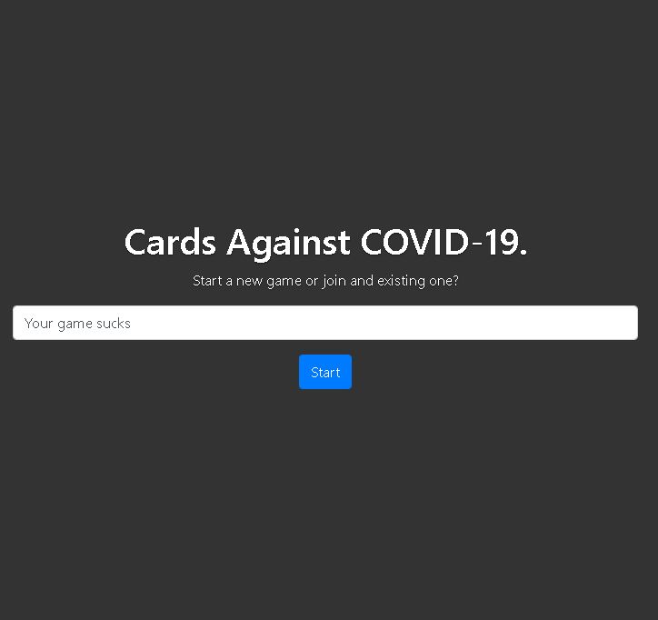

Literally type a name for the lobby, click start

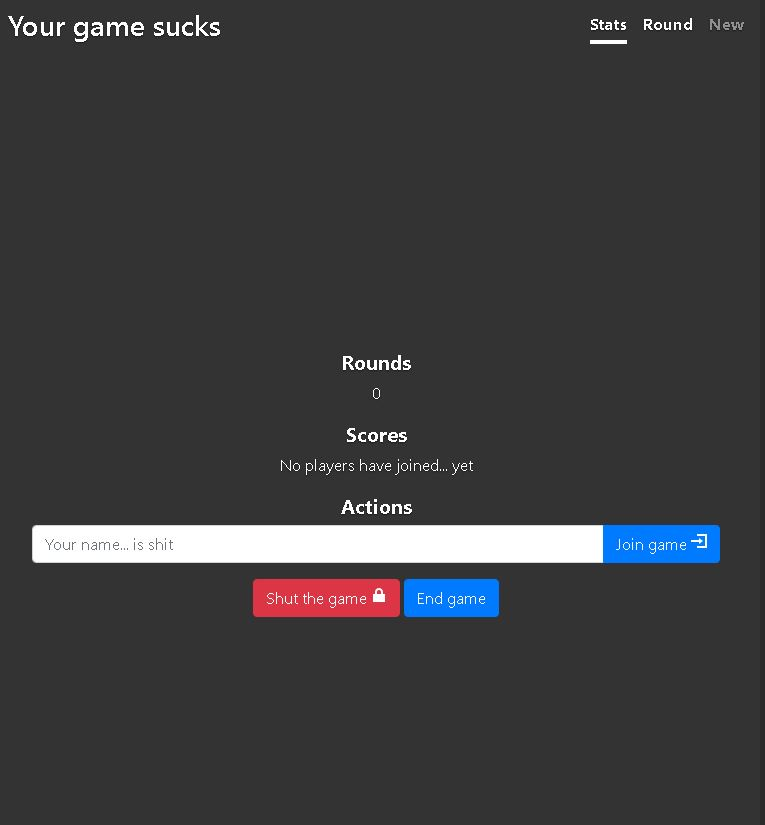

Enter your name and click, Join game

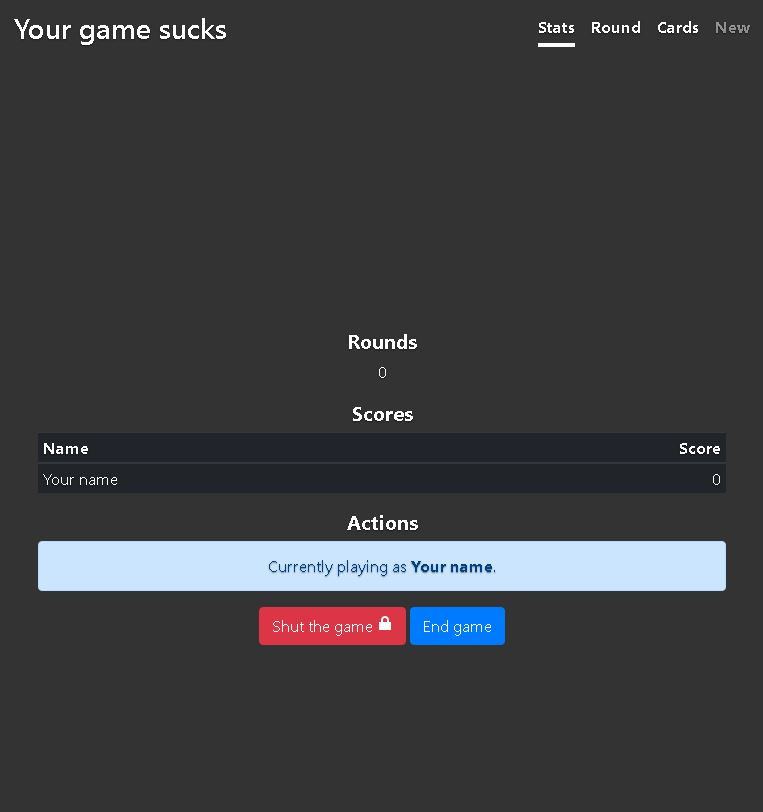

You should now have joined the game

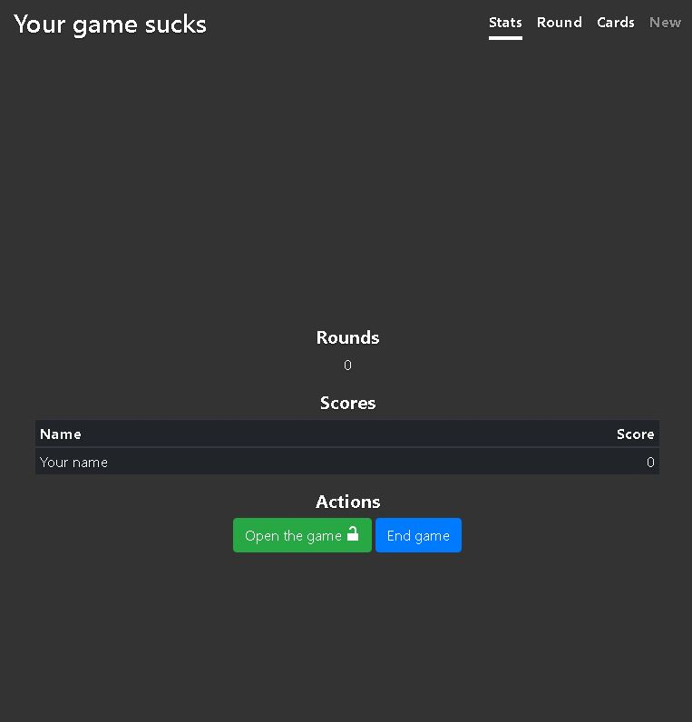

You can also lock the game so others cant join

### Round

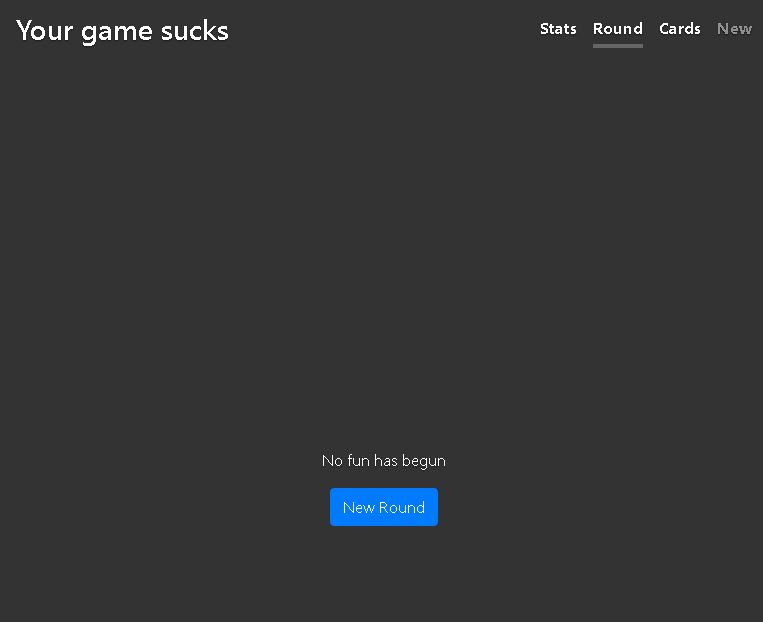

Hit the New round button to bring up a prompt 'black' card

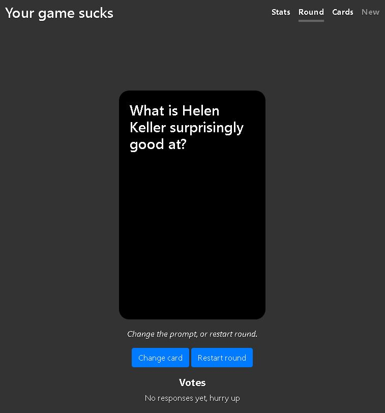

If you dont like it, you can change the prompt and users can reset their responses, or you can simply restart the round and start it again

### Your cards

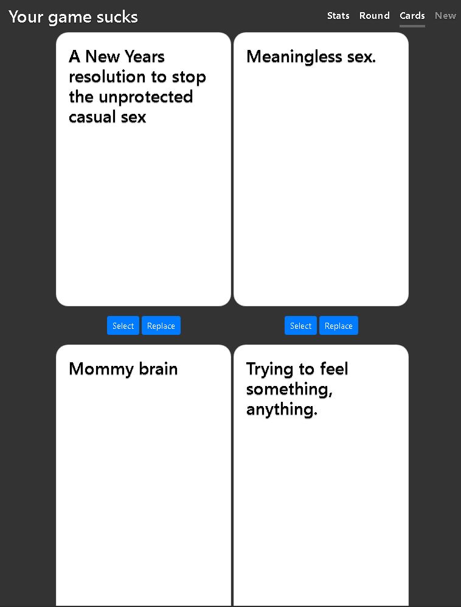

Top right nav is all your cards

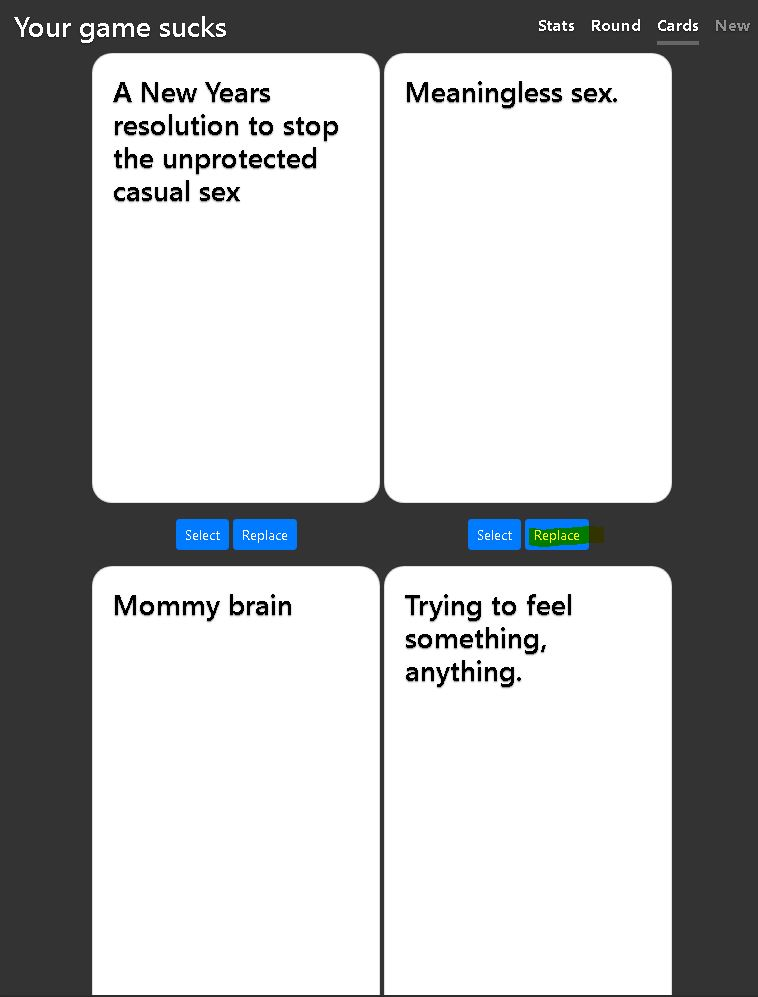

If you dont like them, you can mix it up by replacing one, or scrolling to the bottom of the cards page and changing them all.

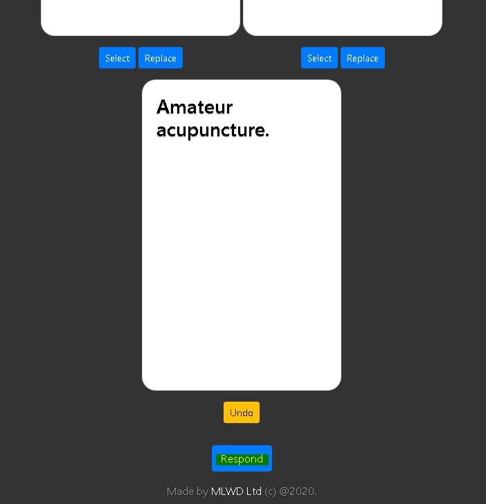

When you find the card(s) to play, click select, then scroll to the bottom and hit Respond

### Viewing and Voting

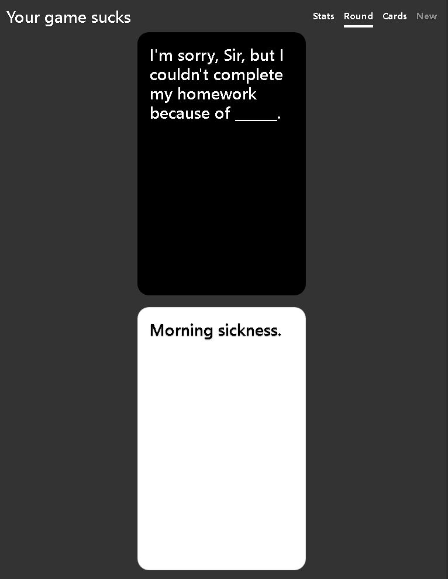

Once everyone has voted you can have a look at their responses, or read them out if you like

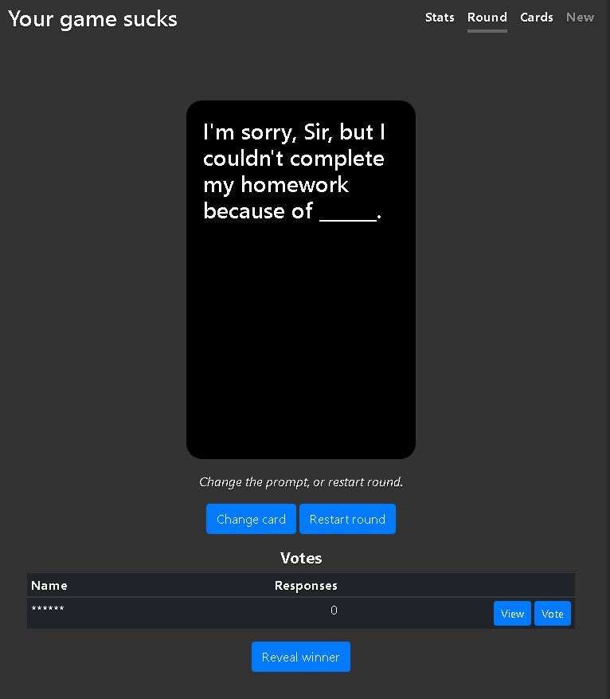

You can then vote for your favourite, even yourself you scumbag.

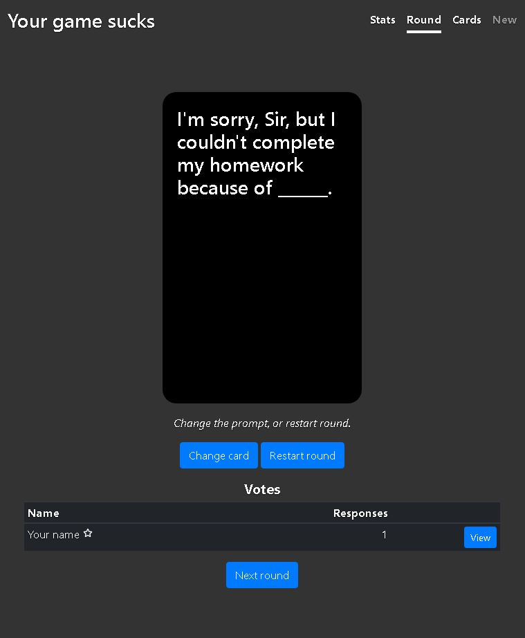

Then you can hit the Reveal winner button to see who was the most offensive.

### Completing

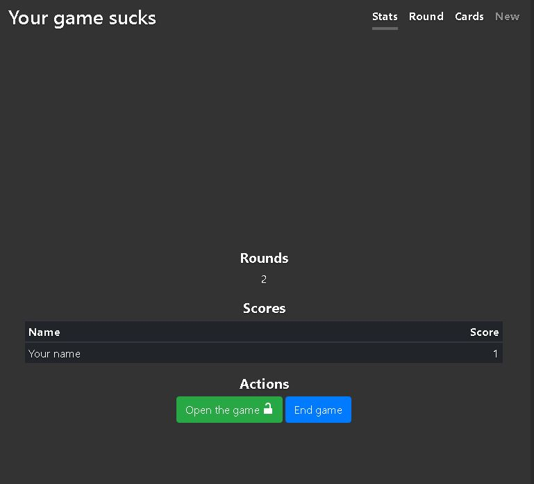

When you start a new round the leaderboard on the front Stats page is updated to reflect the last round winner.

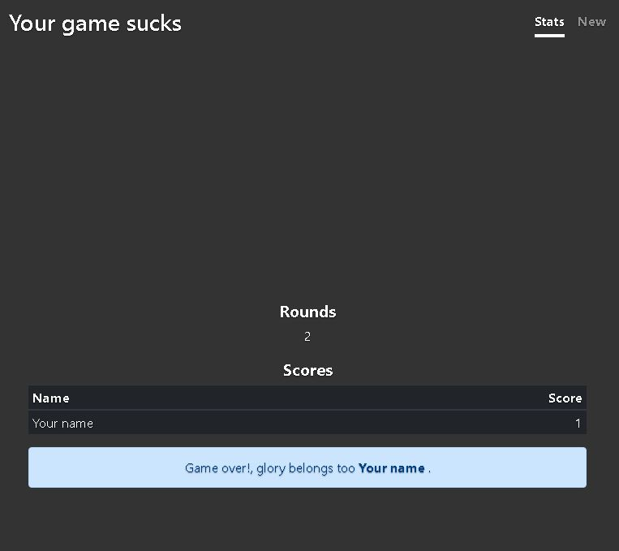

When the game is over the person with the most black card round wins is the champ.

## Built with

### Azure Function Actor Table Entities

Have a play and see what you think, I built this with it:

[https://github.com/micklaw/Actor-Table-Entities](https://github.com/micklaw/Actor-Table-Entities)

## License

Free and open source as per Cards Against Humanity's terms and conditions.